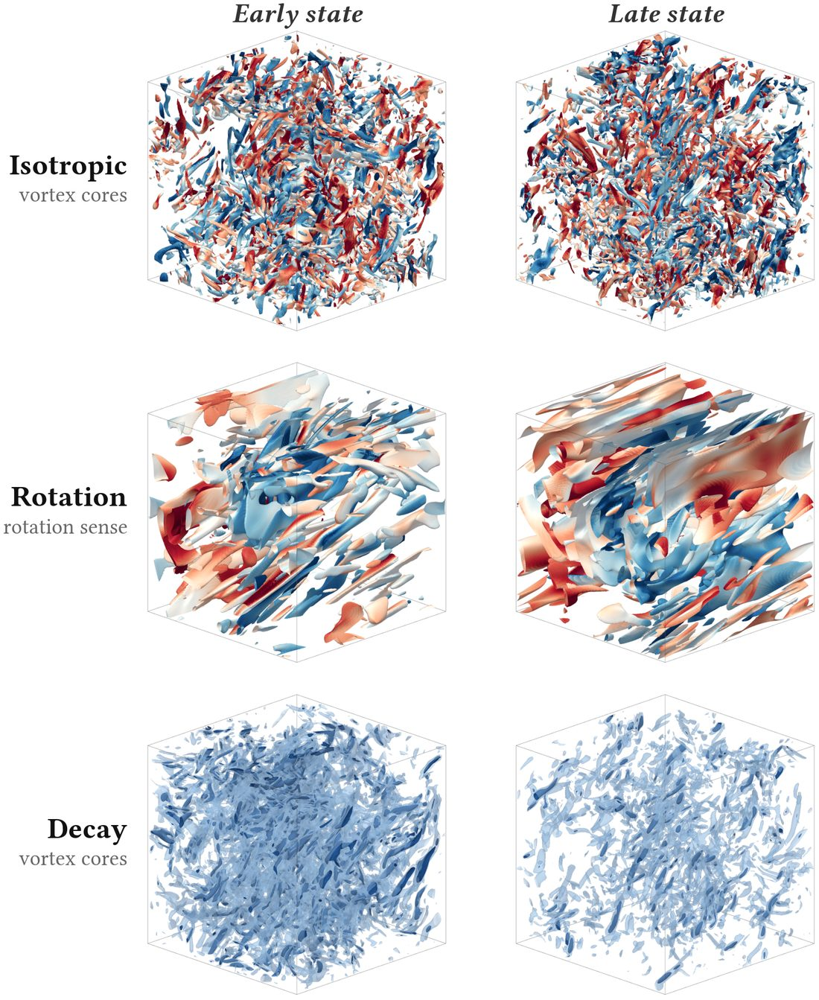
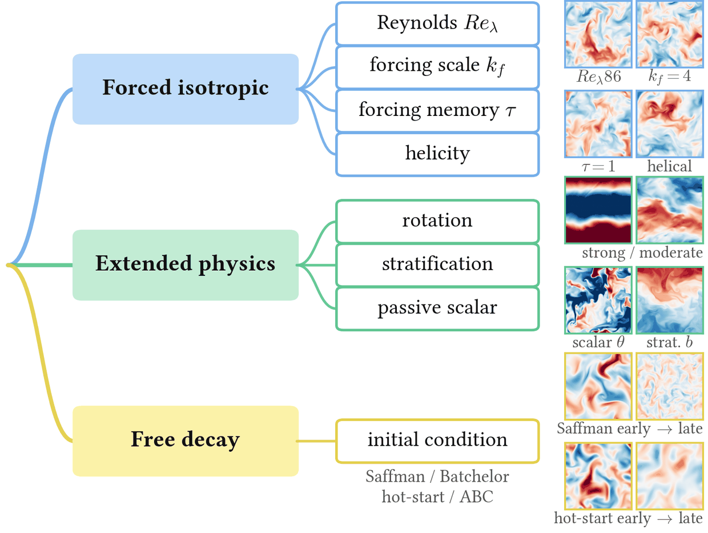
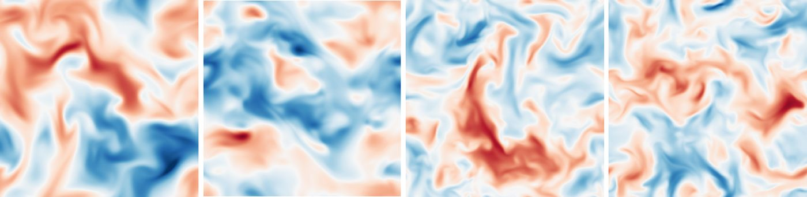
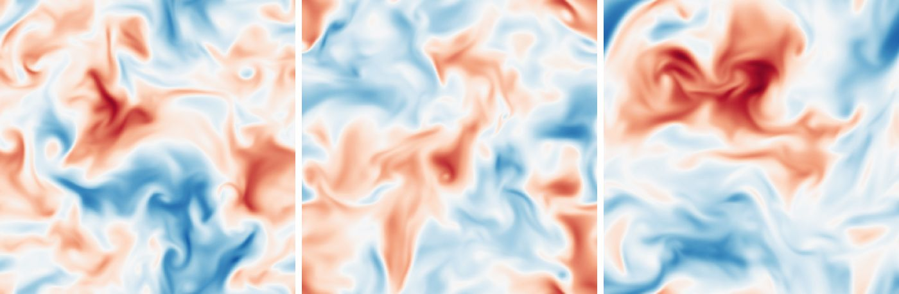
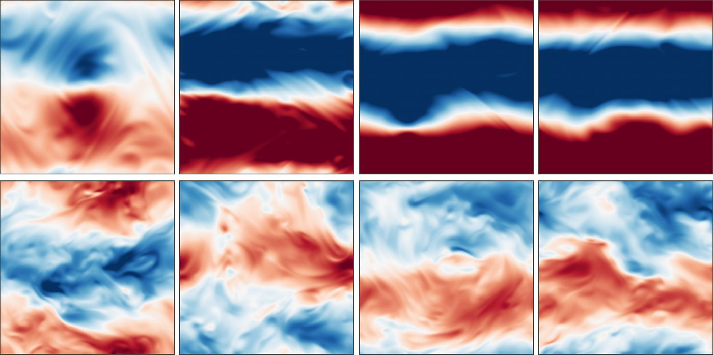
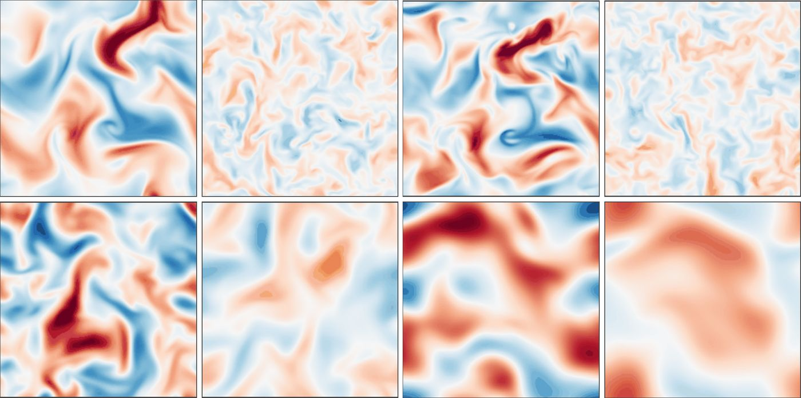
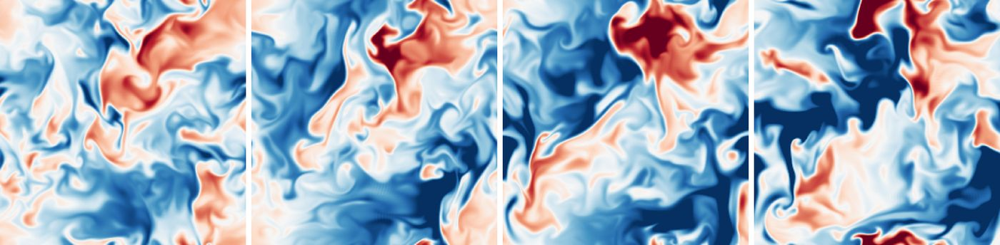
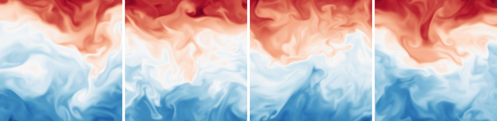

<br>
<p align="center">

<h1 align="center"><strong>TIDE: A Physically Diverse 3D Turbulence Benchmark Dataset<br>for Advancing Scientific Machine Learning</strong></h1>
  <p align="center">
              <a>Yilong Dai<sup>1</sup>,</a>
              <a>Yiming Sun<sup>2</sup>,</a>
              <a>Yiheng Chen<sup>1</sup>,</a>
              <a>Shengyu Chen<sup>2</sup>,</a>
              <a>Peyman Givi<sup>2</sup>,</a>
              <a>Xiaowei Jia<sup>2</sup>,</a>
              <a>Runlong Yu<sup>1</sup></a>
    <br>
    <sup>1</sup>University of Alabama, <sup>2</sup>University of Pittsburgh<br>
  </p>

<p align="center">
  <a href="https://arxiv.org/abs/2608.04222" target="_blank">
    
  </a>
  <a href="https://huggingface.co/datasets/ydai17/TIDE" target="_blank">
    
  </a>
  <a href="https://doi.org/10.5281/zenodo.21589489" target="_blank">
    
  </a>
  <a href="https://github.com/Dyloong1/TIDE-dataset-benchmark/blob/main/LICENSE" target="_blank">
    
  </a>
  <a href="https://creativecommons.org/licenses/by/4.0/" target="_blank">
    
  </a>
</p>


## 🌀 What is TIDE?

**TIDE** (**T**urbulent **I**ncompressible **D**NS **E**nsembles) is a 256³ fp64 DNS
corpus and benchmark for 3D incompressible turbulence: **15 configurations on
eight controlled physics axes** (forced isotropic / extended physics / free
decay), each shipping **8–16 fully independent realizations** (134 trajectories,
~2.6 TB), each released only after passing a fixed acceptance standard of
statistical gates **and equation-level residual checks**. A companion benchmark
provides five tasks, audited baselines under one fixed protocol, generalization
splits along the physics axes, and physical-fidelity metrics alongside
pointwise error.

<div align="center">
  
  &nbsp;
  
</div>

If you find this repository or our paper useful, please consider **starring**
the repository and **citing** the paper:

```bibtex
@misc{dai2026tide,
  title={TIDE: A Physically Diverse 3D Turbulence Benchmark Dataset for Advancing Scientific Machine Learning},
  author={Yilong Dai and Yiming Sun and Yiheng Chen and Shengyu Chen and Peyman Givi and Xiaowei Jia and Runlong Yu},
  year={2026},
  eprint={2608.04222},
  archivePrefix={arXiv},
  primaryClass={physics.flu-dyn},
  url={https://arxiv.org/abs/2608.04222},
}
```

## 🖼️ A look at the data

Mid-plane slices, one row per configuration and several frames each: configurations
differ visibly, while frames within one configuration stay statistically alike.

<table align="center">
  <tr>
    <td align="center" width="50%"><b>Forced isotropic</b> ($u_x$)<br>
      </td>
    <td align="center" width="50%"><b>Forced isotropic, remaining axes</b> ($u_x$)<br>
      </td>
  </tr>
  <tr>
    <td align="center"><b>Rotating</b> (Taylor–Proudman columns, two rates)<br>
      </td>
    <td align="center"><b>Free decay</b> (four families, early → late)<br>
      </td>
  </tr>
  <tr>
    <td align="center"><b>Passive scalar</b> ($\theta$)<br>
      </td>
    <td align="center"><b>Stratified</b> (buoyancy $b$)<br>
      </td>
  </tr>
</table>

## 🗞️ News

- **[2026-08]** The paper is on arXiv: [arXiv:2608.04222](https://arxiv.org/abs/2608.04222).
- **[2026-07]** Corpus v1 released: 15 configurations on HuggingFace
  ([`ydai17/TIDE`](https://huggingface.co/datasets/ydai17/TIDE), one repository
  per configuration) with the citable DOI record
  [10.5281/zenodo.21589489](https://doi.org/10.5281/zenodo.21589489)
  (datasheet, code snapshot, split manifest).

## 🔗 Resources

| | |
|---|---|
| 📄 Paper (arXiv) | https://arxiv.org/abs/2608.04222 |
| 🤗 Dataset (full corpus, ~2.6 TB) | https://huggingface.co/datasets/ydai17/TIDE |
| 🏷️ DOI (citable record) | https://doi.org/10.5281/zenodo.21589489 |
| 💻 Code | https://github.com/Dyloong1/TIDE-dataset-benchmark |
| ⚖️ License | data CC-BY-4.0, code MIT |

Everything below is runnable: dataset generation, the acceptance referee, and
the benchmark. To *use* the data, read [Data](#-data) and
[Benchmark](#-benchmark); to *regenerate or extend* the corpus, read
[Reproducing the corpus](#-reproducing-the-corpus) and
[DNS acceptance](#-dns-acceptance).

## 📑 Table of Contents

- [🚀 Install](#-install)
- [📥 Data](#-data)
- [🌊 Reproducing the corpus](#-reproducing-the-corpus)
- [✅ DNS acceptance](#-dns-acceptance)
- [📊 Benchmark](#-benchmark)
- [📂 Repository layout](#-repository-layout)
- [⚙️ Environment variables](#%EF%B8%8F-environment-variables)
- [📜 Citation](#-citation)

---

## 🚀 Install

```bash
git clone https://github.com/Dyloong1/TIDE-dataset-benchmark.git
cd TIDE-dataset-benchmark
pip install torch numpy scipy zarr matplotlib pyyaml pytest
export TURBGEN_DATA_DIR=/path/to/tide-data     # root holding corpus/ (default ./data)
pytest tests/ -q                               # solver + acceptance-referee self-tests
```

Python ≥3.10, PyTorch ≥2.7 with CUDA. Production runs are fp64 on one 32 GB
consumer GPU (RTX 5090 class); benchmark training runs in bf16. On Windows set
`KMP_DUPLICATE_LIB_OK=TRUE` (every entry point also does `import solver._env`,
which handles this).

---

## 📥 Data

The corpus is **not** in this repository; it is hosted on HuggingFace, one
repository per configuration, indexed at
[`ydai17/TIDE`](https://huggingface.co/datasets/ydai17/TIDE). Each
configuration is one chunked zarr store:

```
$TURBGEN_DATA_DIR/
  corpus/
    ou_relam90_256_fp64.zarr/     # velocity [N,3,256,256,256] fp32, pressure [N,256^3],
    ou_robust_kf3_256_fp64.zarr/  # optional theta/b channel, per-frame t and k_max*eta,
    ...                           # seed index; one frame per chunk (zstd)
    <CASE>_norm_minmax.json       # frozen normalizer sidecar, per configuration
    benchmark_slice.json          # deterministic train/val/test manifest
```

Download one configuration to get started (~20 GB per trajectory):

```bash
pip install -U huggingface_hub
huggingface-cli download ydai17/TIDE-ou_relam90_256_fp64 \
    --repo-type dataset --local-dir $TURBGEN_DATA_DIR/corpus
```

`benchmark/Dataset/turbgen_zarr_dataset.py` reads these stores directly.

### The 15 released configurations

| Paper name | Config file | Family |
|---|---|---|
| Re_lambda 86 (flagship) | `experiments/phase0/configs/ou_relam90_256_fp64.yaml` | forced |
| Re_lambda 70 | `experiments/phase0/configs/ou_relam70_256_fp64.yaml` | forced |
| Re_lambda 55 | `experiments/phase0/configs/ou_relam50_256_fp64.yaml` | forced |
| k_f = 3 | `experiments/phase0/configs/ou_robust_kf3_256_fp64.yaml` | forced |
| k_f = 4 | `experiments/phase0/configs/ou_robust_kf4_256_fp64.yaml` | forced |
| tau = 1 | `experiments/phase0/configs/ou_robust_tau1_256_fp64.yaml` | forced |
| helical | `experiments/phase0/configs/helical_re86_retune2_256_fp64.yaml` | forced |
| rotating (strong) | `experiments/phase_ext/configs/rotating_ro0p2_256_fp64.yaml` | extended |
| rotating (moderate) | `experiments/phase_ext/configs/rotating_ro0p2_v2_256_fp64.yaml` | extended |
| passive scalar | `experiments/phase_ext/configs/scalar_sc1_256_fp64.yaml` | extended |
| stratified | `experiments/phase_ext/configs/stratified_reb40_256_fp64.yaml` | extended |
| decay (hot-start) | `experiments/phase0/configs/decay_hotstart_re86.yaml` | decay |
| decay (Saffman) | `experiments/phase0/configs/decay_saffman_v2.yaml` | decay |
| decay (Batchelor) | `experiments/phase0/configs/decay_batchelor_v2.yaml` | decay |
| decay (ABC) | `experiments/phase0/configs/abc_turb_full_256_fp64.yaml` | decay |

Ensemble members are the `*_pool<K>.yaml` variants, or the same YAML run with a
different `--seed`.

---

## 🌊 Reproducing the corpus

Each configuration comes from a long fp64 run that discards a spin-up window
and exports frames at a fixed cadence of 0.05 T_L; the frames are converted to
zarr, a normalizer is frozen, and a deterministic benchmark slice is written.
One 256³ trajectory costs roughly 7 GPU-hours.

### 1. Forced isotropic

```bash
python experiments/phase0/run_forced_hit.py \
    --config experiments/phase0/configs/ou_relam90_256_fp64.yaml \
    --t-spinup 30 --t-sample 400 --checkpoint-every 25 \
    --frame-every-TL 0.05 --seed 0 --ou-seed-per-ic --eps-sentinel
```

`--ou-seed-per-ic` is **required for ensembles**: it gives each
initial-condition seed its own OU forcing realization. Sharing one forcing
sequence across seeds imprints a common directional bias that pooling cannot
remove. Repeat with `--seed 1,2,...` for the other members. `--eps-sentinel`
aborts a trajectory whose dissipation collapses. For unattended long runs with
automatic resume, use
`run_ou_xval_resumable.py --case <name> --ic-seed <k>`.

### 2. Extended physics

```bash
python experiments/phase_ext/run_rotating_hit.py \
    --config experiments/phase_ext/configs/rotating_ro0p2_256_fp64.yaml \
    --t-spinup 30 --t-sample 400 --frame-every-TL 0.05 --seed 0 --ou-seed-per-ic
```

`run_scalar_hit.py` and `run_stratified_hit.py` take the same flags with their
own configs. The scalar runner also accepts `--resume-u-ckpt` to advect a
scalar through an already-matured velocity field.

### 3. Free decay

Cold-start families (Saffman p=2, Batchelor p=4, ABC) are ordinary runs whose
config sets `forcing: none`, so the same driver applies:

```bash
python experiments/phase0/run_forced_hit.py \
    --config experiments/phase0/configs/decay_saffman_v2.yaml \
    --t-sample 60 --frame-every-TL 0.05 --seed 0
```

The hot-start family decays from a matured forced state and resumes from a
checkpoint. **Each ensemble member must resume from a different parent
checkpoint**: resuming one checkpoint under different seed labels produces
bit-identical copies, a defect the seed-independence test now blocks.

```bash
python experiments/phase0/run_forced_hit.py \
    --config experiments/phase0/configs/decay_hotstart_re86.yaml \
    --resume-from-ckpt <parent_run_k>/ckpt_t00040.00.pt \
    --t-sample 20 --frame-every-TL 0.05
```

### 4. Export, normalize, split

```bash
python experiments/phase0/corpus_to_zarr.py ou_relam90_256_fp64        # frames -> chunked zarr
python experiments/phase0/freeze_norm_from_zarr.py --case ou_relam90_256_fp64
python experiments/phase0/write_dataset_manifest.py                    # per-config manifest
python experiments/phase0/make_benchmark_slice.py --frames 150         # train/val/test slice
```

The slice ranks trajectories within each configuration by a model-independent
quality score (resolution margin, energy drift, isotropy, timeline splices,
frame count), then assigns the top three to training, the fourth to validation,
and the next three to test. The weights ship with the manifest; hand-edited
manifests are rejected.

---

## ✅ DNS acceptance

No configuration enters the corpus without passing the acceptance standard.
The referee itself is tested against known-answer synthetic fields, including
deliberately violating fields that must be rejected
(`tests/test_eval_acceptance.py`).

### Statistical gates

```bash
python experiments/phase0/eval_dns_standard.py ou_relam90_256_fp64
```

Reads `experiments/phase0/results/<case>/` (metrics, time-averaged spectra,
checkpoint fields) and writes `results/<case>/DNS_STANDARD_APPENDIX_A.md` with
a provenance stamp (git hash, date, machine, library versions). It reports the
resolution class (Class I requires k_max*eta >= 1.5), thirteen binary gates
(resolved dissipation, spectral tail, scale separation, time-step resolution,
energy drift, injection-dissipation closure, sampling protocol, component and
gradient isotropy, incompressibility, derivative skewness), and the
literature-band quantities, which are reported rather than gated.

### Equation-level checks

These need dedicated frame triplets exported with the forcing frozen, so run
the showcase first, then the evaluator:

```bash
python experiments/phase0/run_trajectory_showcase.py \
    --config experiments/phase0/configs/ou_relam90_256_fp64.yaml \
    --ckpt-dir experiments/phase0/results/ou_relam90_256_fp64 \
    --out experiments/phase0/results/trajectory_showcase_ou_relam90_256_fp64 \
    --residual-every 5 --n-halfdt 2

python experiments/phase0/eval_dynamics_residuals.py ou_relam90_256_fp64
```

This appends the equation-level table to the same appendix file: the divergence
residual, the momentum residual on frozen-forcing triplets, the step-halving
convergence ratio (expected ~4, i.e. second order in time), and the
velocity-pressure Poisson consistency of the released pressure channel.

### Extended physics and free decay

```bash
python experiments/phase_ext/eval_anisotropic.py rotating_ro0p2_256_fp64
python experiments/phase_ext/eval_dynamics_ext.py \
    --config experiments/phase_ext/configs/rotating_ro0p2_256_fp64.yaml
python experiments/phase0/eval_decaying.py decay_saffman_v2
```

`eval_anisotropic.py` reports the regime diagnostics (Rossby number,
two-dimensional energy fraction, anisotropy tensor, relative helicity; Froude
number, buoyancy Reynolds number, Ozmidov scale, potential-to-kinetic energy
ratio for the stratified case). `eval_dynamics_ext.py` runs the equation-level
checks with the Coriolis and buoyancy source terms included.

For rotating, stratified, scalar, and decaying flows the isotropy and
stationarity gates do not apply, since anisotropy or non-stationarity is the
physics under study. Resolution, incompressibility, and the equation-level
checks stay hard, with an added resolution gate per extension (Batchelor scale
for the scalar case, Ozmidov scale and buoyancy Reynolds number for the
stratified case).

---

## 📊 Benchmark

Five tasks (forecasting, super-resolution, sparse reconstruction, pressure
recovery, subgrid-stress closure), five learned baselines (FNO3d, TFNO,
Spectral U-Net, Transolver, DeepONet-3D), and non-learning references
(persistence, identity, spectral interpolation, the exact spectral Poisson
solve, dynamic Smagorinsky, and an equations-informed spectral integrator).

**Always launch through `run_benchmark_suite.py`.** It pins every protocol flag
explicitly (residual prediction, lr 1e-3, voxel-defined effective batch, native
256³ evaluation, 51 evaluation windows). Calling `train_benchmark.py` directly
silently runs a different protocol.

```bash
python benchmark/run_benchmark_suite.py \
    --slice $TURBGEN_DATA_DIR/corpus/benchmark_slice.json \
    --data-root $TURBGEN_DATA_DIR \
    --configs ou_relam90_256_fp64 --tasks rollout --models fno3d \
    --eval-samples 51 --root runs/demo
```

One cell trains and evaluates in 0.2–0.9 h on one 32 GB GPU. Use `--dry-run` to
print the matrix without running it, `--redo` to overwrite completed cells, and
`--no-nonnn` to skip the non-learning references.

Rebuild the leaderboard from the **released result rows** (no GPU, no data
download):

```bash
python benchmark/aggregate_leaderboard.py --roots \
    benchmark/results_rows/CYB-t benchmark/results_rows/CYB-q benchmark/results_rows/CYB-3
```

Every number in the paper comes from these JSON rows (one per model x task x
configuration).

---

## 📂 Repository layout

| Path | Contents |
|---|---|
| `solver/` | Pseudo-spectral DNS core: grids, spectral operators, initial conditions, Eswaran–Pope OU forcing, RK3 with integrating-factor viscosity, diagnostics, I/O. `operators.py::pressure_hat` is both the pressure solver and the generator of the released pressure channel. |
| `physics_ext/` | Extended-physics terms and diagnostics: rotation (Coriolis), Boussinesq buoyancy, passive scalar. |
| `experiments/phase0/` | Forced and decaying production runs, corpus export, and the acceptance referee. |
| `experiments/phase_ext/` | Extended-physics production runs and their acceptance evaluators. |
| `benchmark/` | Benchmark harness: suite entry point, training and evaluation, metrics, `Model/` (baselines), `Dataset/` (zarr loader and frozen normalizer), `nonnn_ns_integrator.py`. |
| `benchmark/results_rows/` | The released per-run result JSONs behind every number in the paper. |
| `tests/`, `benchmark/tests/` | 127 tests: spectral-operator identities, integrator, forcing, pressure solver, known-answer acceptance-referee tests, metric mutation tests, seed-independence and cache bit-identity guards. |
| `docs/DATASHEET.md` | Datasheet for the dataset. |

## ⚙️ Environment variables

| Variable | Meaning |
|---|---|
| `TURBGEN_DATA_DIR` | Root holding `corpus/`. Default `./data`. |
| `KMP_DUPLICATE_LIB_OK` | Set to `TRUE` on Windows to avoid the duplicate OpenMP runtime abort. |
| `PHYSICS_METRICS_DIR` | Optional; enables cross-check tests against an external metrics implementation. |

## 📜 Citation

```bibtex
@misc{dai2026tide,
  title={TIDE: A Physically Diverse 3D Turbulence Benchmark Dataset for Advancing Scientific Machine Learning},
  author={Yilong Dai and Yiming Sun and Yiheng Chen and Shengyu Chen and Peyman Givi and Xiaowei Jia and Runlong Yu},
  year={2026},
  eprint={2608.04222},
  archivePrefix={arXiv},
  primaryClass={physics.flu-dyn},
  url={https://arxiv.org/abs/2608.04222},
}
```

Machine-readable metadata: [`CITATION.cff`](CITATION.cff).
